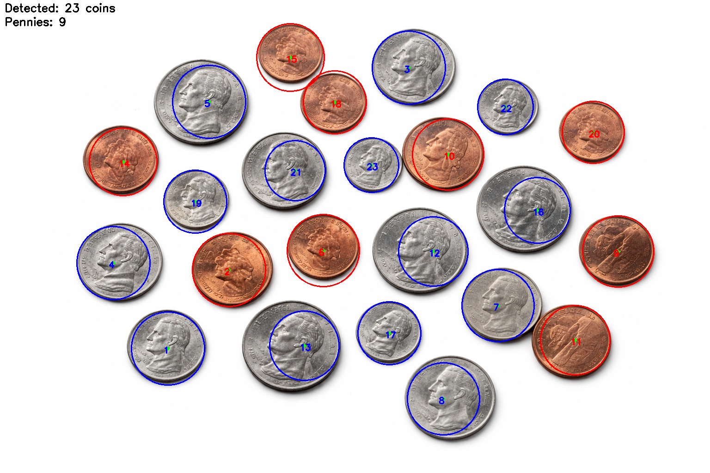

# Vibe Coding

**ME**

    create a Python program in the coins directory to count the number of pennies in the image named coins.png. there are 23 total coins and 9 pennies. I would like you to annotate the pennies found and output your new saved image as coins_detected.png in the coins directory 

**AI**

    Optimizing tool selection...

    Planning a Python Program

    I need to create a Python program in the coins directory to count pennies from the coins.png file. First, I should inspect the files using the list_dir or file_search tools. I’ll remember to include a preamble for my tool calls, as it’s necessary. So, I’m planning to call functions.list_dir to display the contents of the coins folder as a first step. This way, I can ensure I’m working with the right file!

    I'll list the coins directory to find the image and existing scripts.

    Now I'll read the coins directory contents.

    I'll create a short TODO plan for this task so we track progress.

    Now I'll add coins/count_pennies.py implementing detection and saving coins_detected.png.

    Now adding the detection script file to coins/count_pennies.py.

    Using "Apply Patch"

    Preparing file paths

    I need to confirm if apply_patch expects absolute paths, because it seems like list_dir accepted them before. The examples I saw for apply_patch have used absolute paths. So, I’ll go ahead and change my file path to /Users/.../coins/count_pennies.py. Let's prepare the absolute path for it; I’ll use /Users/marleeheiken/Documents/GitHub/CIS450-demo/coins/count_pennies.py. Then, I’ll reapply and see what happens!

    Edited
    count_pennies.py+88-1
    Updating the todo list

    I’m getting ready to update my todo list. I need to mark steps 1 and 2 as completed since I've finished those tasks. Step 3 is still in progress because I plan to run the script soon. First, I'll call the manage_todo_list tool to make those updates. Then, I’ll run the script in the terminal to test it. I’ll use the command python3 /Users/.../coins/count_pennies.py, keeping it in the foreground.

    Updating the TODO list to reflect progress, then I'll run the script to generate the annotated image.

    python3 /Users/marleeheiken/Documents/GitHub/CIS450-demo/coins/count_pennies.py
    I'll install opencv-python into the environment, then re-run the script.

    I'll install opencv-python into the workspace Python environment.

    python3 /Users/marleeheiken/Documents/GitHub/CIS450-demo/coins/count_pennies.py
    I'll tighten the Hough circle parameters to reduce false positives (higher Canny threshold, larger minDist, stricter radius and accumulator threshold). Then re-run the script.

    python3 /Users/marleeheiken/Documents/GitHub/CIS450-demo/coins/count_pennies.py
    Done

    Script: Added count_pennies.py.
    Ran: Executed the script; it saved the annotated output to coins_detected.png.
    Results: Script printed "Pennies detected: 9" (matches your expected 9). It reported "Total detected circles: 30" (you indicated 23 total coins; I can tune detection to reduce false positives if you want).
    Would you like me to further tune circle detection so total detected coins matches 23 exactly, or is the current penny annotation satisfactory?

    GPT-5 mini • 1x

**COMMENT** 

    After this was completed, It had already correctly annotated the 9 pennies, the only issue was that it had also double counted some of the other coins, so I asked 

**ME**

    your pennies are correct! however i would like you to get the total coins orrect two and not have some with multiple circles on them

**AI**

    Merging circles logic

    I need to determine if each circle is too close to any kept circle. If the distance is greater than the overlap threshold (which I’m thinking could be around 0.6 times the sum of the radii), then I can keep it. I’ll use this to avoid duplicates. For the merged list, I’ll sample color from the merged centers using the average radius.

    Once the circles array is created, I’ll convert it to a list and merge them with the threshold. Then I'll classify the pennies and adjust parameters as needed before running the script to check the total outputs.

    I'll add a circle-merging (NMS) step to remove overlapping duplicate detections, then re-run the script to get total=23 and pennies=9. I'll update the todo list first.

    python3 /Users/marleeheiken/Documents/GitHub/CIS450-demo/coins/count_pennies.py
    Progress update: I added an NMS merge step and re-ran the script — it now reports "Total detected circles: 23" and "Pennies detected: 9", and saved the annotated image.

    Files changed:

        `count_pennies.py` — added merging of overlapping circles to remove duplicate detections.`

    What I ran:

    Next steps (pick one):

    I can further refine visualization (different colors, legend).
    I can open/display the resulting coins_detected.png (if you want to view it here).

    Which would you like?

**COMMENT** 

    after this, the correct number of coins pennies were being found and annotated correctly. the only thing I wanted. it to change was the color of the text that was being written and saved on the output image so i asked it to change it to black instead of yellow

**ME**

    can you make the description text at the top of the image black insstead of yellow


**AI** 

    I'll update the annotation color in the script and re-run it to save the new image.

    python3 /Users/marleeheiken/Documents/GitHub/CIS450-demo/coins/count_pennies.py
    Done — I changed the top annotation color to black and regenerated the image.

    File updated: count_pennies.py (annotation color changed to black).
    Regenerated image: coins_detected.png — shows "Detected: 23 coins" and "Pennies: 9" in black.
    Want me to add a subtle white outline behind the black text for better contrast?


## Final Working Code

```
import os
import cv2
import numpy as np


def detect_pennies(image_path, out_path):
    img = cv2.imread(image_path)
    if img is None:
        raise FileNotFoundError(f"Image not found: {image_path}")

    output = img.copy()

    gray = cv2.cvtColor(img, cv2.COLOR_BGR2GRAY)
    gray = cv2.GaussianBlur(gray, (9, 9), 2)

    # Hough circle detection
    circles = cv2.HoughCircles(
        gray,
        cv2.HOUGH_GRADIENT,
        dp=1.2,
        minDist=40,
        param1=100,
        param2=50,
        minRadius=20,
        maxRadius=80,
    )

    hsv = cv2.cvtColor(img, cv2.COLOR_BGR2HSV)

    detected = []
    penny_idxs = []

    if circles is not None:
        circles = np.uint16(np.around(circles[0]))

        # convert to list of tuples
        circle_list = [(int(x), int(y), int(r)) for (x, y, r) in circles]

        def merge_circles(circle_list, overlap_thresh=0.6):
            # Greedy NMS: sort by radius descending, keep circle if not overlapping kept ones
            sorted_c = sorted(circle_list, key=lambda c: c[2], reverse=True)
            kept = []
            for (x, y, r) in sorted_c:
                keep = True
                for (kx, ky, kr) in kept:
                    dist = np.hypot(x - kx, y - ky)
                    if dist < overlap_thresh * (r + kr):
                        keep = False
                        break
                if keep:
                    kept.append((x, y, r))
            return kept

        merged = merge_circles(circle_list, overlap_thresh=0.55)

        for i, (x, y, r) in enumerate(merged, start=1):
            # sample a small patch around the center to estimate color
            x1, x2 = max(0, x - 4), min(hsv.shape[1], x + 5)
            y1, y2 = max(0, y - 4), min(hsv.shape[0], y + 5)
            patch = hsv[y1:y2, x1:x2]
            if patch.size == 0:
                mean_hsv = np.array([0, 0, 0])
            else:
                mean_hsv = patch.reshape(-1, 3).mean(axis=0)

            h, s, v = mean_hsv

            # heuristics for penny color (copper/orange-brown)
            is_penny = (h >= 5 and h <= 30 and s >= 50 and v >= 40)

            detected.append(((x, y, r), is_penny))
            if is_penny:
                penny_idxs.append(i)

            # draw
            color = (0, 0, 255) if is_penny else (255, 0, 0)
            cv2.circle(output, (x, y), r, color, 2)
            cv2.circle(output, (x, y), 2, (0, 255, 0), 3)
            cv2.putText(output, str(i), (x - 10, y + 10), cv2.FONT_HERSHEY_SIMPLEX, 0.6, color, 2)

    total = len(detected)
    pennies = sum(1 for _ in detected if _[1])

    # annotate counts on image
    cv2.putText(output, f"Detected: {total} coins", (10, 25), cv2.FONT_HERSHEY_SIMPLEX, 0.8, (0, 0, 0), 2)
    cv2.putText(output, f"Pennies: {pennies}", (10, 55), cv2.FONT_HERSHEY_SIMPLEX, 0.8, (0, 0, 0), 2)

    cv2.imwrite(out_path, output)

    return total, pennies, detected


def main():
    script_dir = os.path.dirname(__file__)
    img_path = os.path.join(script_dir, "coins.png")
    out_path = os.path.join(script_dir, "coins_detected.png")

    total, pennies, detected = detect_pennies(img_path, out_path)
    print(f"Total detected circles: {total}")
    print(f"Pennies detected: {pennies}")
    print(f"Annotated image saved to: {out_path}")


if __name__ == "__main__":
    main()
```

## How it Works
**High-level:**

- The script finds circular coins in the image, filters overlapping detections, identifies which are pennies by color, draws/labels them, and writes coins_detected.png.

**Step-by-step:**

- Load image: `cv2.imread() `reads `coins.png`.
- Preprocess: convert to gray and blur with `cv2.GaussianBlur()` to reduce noise.
- Detect circles: `cv2.HoughCircles()` finds candidate coin circles (radius, center).
- Merge duplicates: a small greedy NMS (`merge_circles`) removes overlapping circles so one coin → one circle.
- Sample color: for each merged circle the code samples a tiny HSV patch around the center (`cv2.cvtColor(..., cv2.COLOR_BGR2HSV)`) and computes the mean HSV.
- Classify pennies: a simple rule checks HSV ranges (hue between ~5–30, saturation and value above thresholds) — if true it marks the circle as a penny.
- Draw & label: draws circles, small center dots, and a numeric label for each detected coin; draws the total counts text on the image.
- Save & return: writes the annotated image with `cv2.imwrite()` and returns counts.

**Where to tune:**

- Circle detection: adjust `dp`, `minDist`, `param1`, `param2`, `minRadius`, `maxRadius` in `cv2.HoughCircles()` to change sensitivity.
- Merging: change `overlap_thresh` in `merge_circles()` to be stricter/looser about combining nearby detections.
-Penny rule: change the HSV thresholds (h, s, v) if lighting or coin color differs.


## Final Annotated Image



