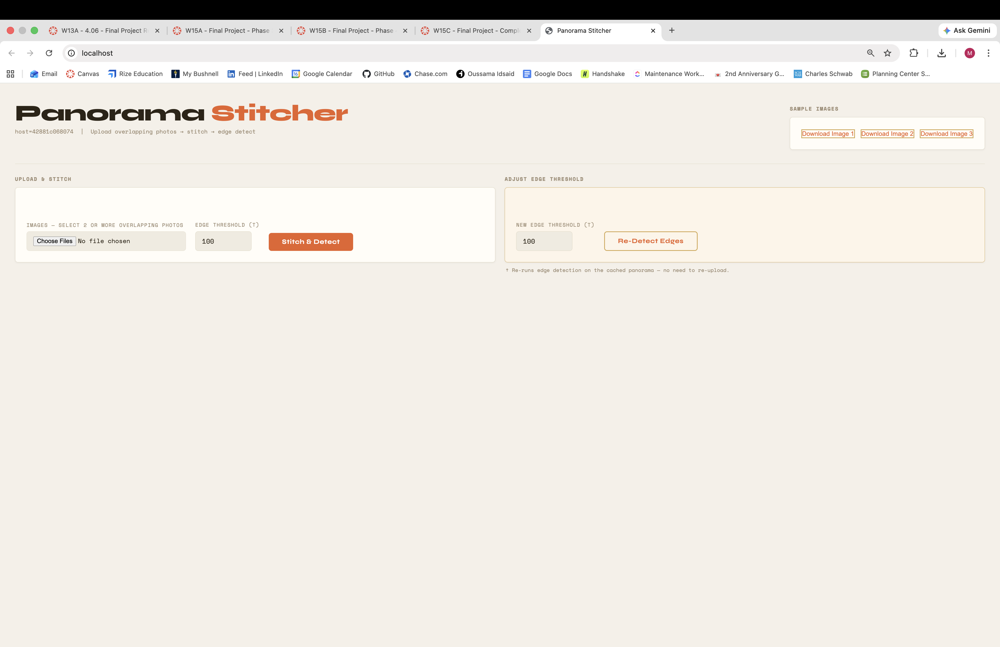
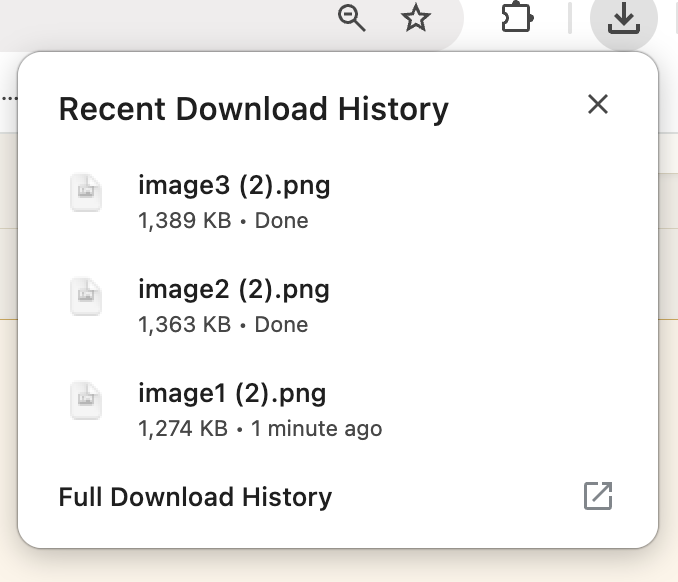
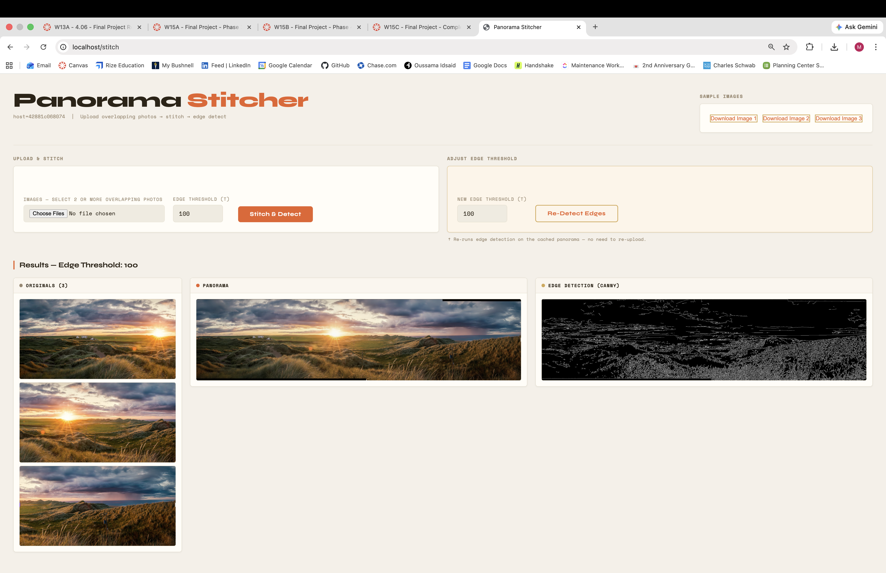
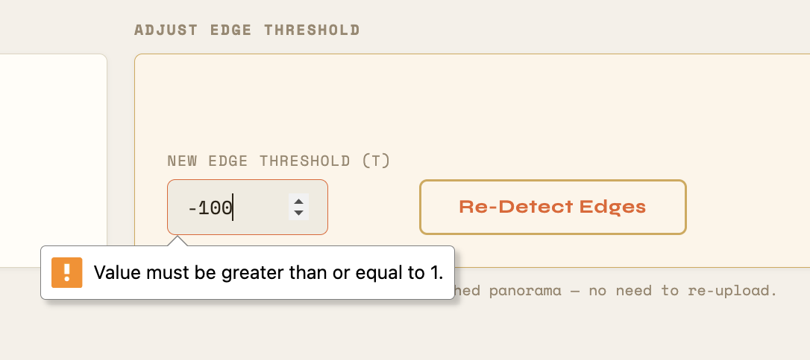
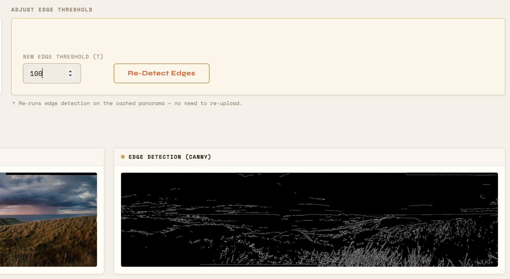
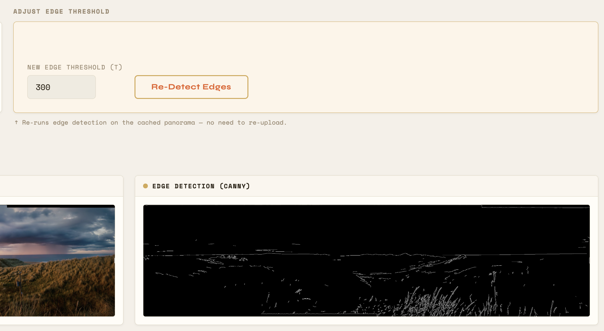

# Final Project

## Description

The project I want to do builds off of yours, but will add in making a panorama. I want people to be able to upload a series of overlapping photos, that will be stiched together into a single panoramic image using OpenCV. Then, after the images are made into a panoramic image I want to perform edge processing on in. I will display all of the steps side by side, so on the left it will have all of the original overlapping images you sibmitted, then it will have the panorama in the middle, and on the right it will display the edge detected panorama. 

## Design

First I will need to make it so that the Flask web interface can accept multiple files instead of just one. Ill do this by using `request.files.getlist()` instead of `request.files.get()`. Then I am planning on using open CVs panorama stitching functionality,Stitcher_PANORAMA, to do the panorama portion of this project. In my previous project, I used Stitcher_SCANS, but I have learned that Stitcher_PANORAMA is better when using pictures that are not perfectly level/straight because tey were taken by a person. After the panorama is made, I will just pass it through the same `detect_edges()` function that already exists in the template you gave us. The Flask web interface will  to accept multiple file uploads, display each original photo, the stitched panorama, and the final edge-detected output side by side. 
 
I am using Claude to help me with the assignment. I told it my idea in the beginning to make sure that it was all possible and I asked it today about how to make the web gui accept multiple photos instead of 1. It also helped me understand the difference between Stitcher_SCANS and Stitcher_PANORAMA, which helped me realize what I did wrong in my original panorama project. 

## How AI helped during implementation:

- Using my Project Description and Design plan we had made for our readme, the example app.py file you provided us, and the steps for the implementation project I promped Claude to adjust the file to do what my project outlined. Using this prompt claud provided me code that ran, accepted images, made a panorama, and then performed edge detecting on it. After that I made UI tweaks myself, and used Claude to figure out an additional feature of making it so the user can download sample images to use for the panorama in case they don't have any on hand to use.

### Prompt Used:
```
this is my final project for an emergent technologies class. this is my plan: 

Final Project

Description

The project I want to do builds off of yours, but will add in making a panorama. I want people to be able to upload a series of overlapping photos, that will be stiched together into a single panoramic image using OpenCV. Then, after the images are made into a panoramic image I want to perform edge processing on in. I will display all of the steps side by side, so on the left it will have all of the original overlapping images you sibmitted, then it will have the panorama in the middle, and on the right it will display the edge detected panorama. 

Design

First I will need to make it so that the Flask web interface can accept multiple files instead of just one. Ill do this by using `request.files.getlist()` instead of `request.files.get()`. Then I am planning on using open CVs panorama stitching functionality,Stitcher_PANORAMA, to do the panorama portion of this project. In my previous project, I used Stitcher_SCANS, but I have learned that Stitcher_PANORAMA is better when using pictures that are not perfectly level/straight because tey were taken by a person. After the panorama is made, I will just pass it through the same `detect_edges()` function that already exists in the template you gave us. The Flask web interface will  to accept multiple file uploads, display each original photo, the stitched panorama, and the final edge-detected output side by side. 

I am using Claude to help me with the assignment. I told it my idea in the beginning to make sure that it was all possible and I asked it today about how to make the web gui accept multiple photos instead of 1. It also helped me understand the difference between Stitcher_SCANS and Stitcher_PANORAMA, which helped me realize what I did wrong in my original panorama project.
I need to modify this file to complete the project. 


# final project example template
#
# to build:   docker build -t app .      
# to run:     docker run -p 80:80 app
# in browser: http://localhost

from flask import Flask, request, send_file, render_template_string, send_from_directory
import os
import cv2
import socket

app = Flask(__name__)

hostname = socket.gethostname()

UPLOAD_FOLDER = "static"
os.makedirs(UPLOAD_FOLDER, exist_ok=True)
LAST_T = 100

HTML = """
<h2>Image Processor</h2>
<p><i>host={{ hostname }}</i></p>

<form method="POST" action="/edges" enctype="multipart/form-data">
    <label>Image:</label>
    <input type="file" name="file">

    <label>Threshold:</label>
    <input type="number" name="T" value="{{ threshold }}">

    <input type="submit" value="Run">
</form>

<hr>



<h3>Result (Threshold: {{ threshold }})</h3>

<div style="display:flex; gap:20px; align-items:flex-start;">

    <div>
        <p><b>Original</b></p>
        
    </div>

    <div>
        <p><b>Processed</b></p>
        
    </div>

</div>


"""

def detect_edges(input_path, output_path, T=100):
    T1 = int(T * 0.5)
    T2 = int(T)
    img = cv2.imread(input_path)
    edges = cv2.Canny(img, T1, T2)
    cv2.imwrite(output_path, edges)
    return output_path


@app.route("/")
def home():
    return render_template_string(
        HTML,
        threshold=LAST_T,
        hostname=hostname
    )


@app.route("/output.jpg")
def output_image():
    return send_file("output.jpg", mimetype="image/jpeg")


@app.route("/edges", methods=["POST"])
def edges_route():
    T = request.form.get("T", default=100, type=int)
    LAST_T = T

    file = request.files.get("file", None)

    original_path = os.path.join(UPLOAD_FOLDER, "original.jpg")
    output_path = os.path.join(UPLOAD_FOLDER, "output.jpg")

    if file and file.filename != "":
        file.save(original_path)

    if not os.path.exists(original_path):
        return "No image uploaded yet."

    detect_edges(original_path, output_path, T)

    return render_template_string(
        HTML,
        original="/static/original.jpg",
        processed="/static/output.jpg",
        threshold=LAST_T,
        hostname=hostname
    )


if __name__ == "__main__":
    port = int(os.environ.get("PORT", 80))
    app.run(host="0.0.0.0", port=port)

Here are the steps for this week :

3. Create running code that runs from a docker container per build instructions given at the top of the template app.py example – ask teacher if you need to modify build method for some reason
4. Provide documentation at the top of app.py and any other python files you create that explain what the file does. Update README.md to include how AI helped you during implementation.
5. Document each method or function as well as sections inside each method, to provide clear documentation to your teacher that shows that you understand how the code works
6. You are encouraged to attend in-class project sessions and ask for help from your teacher
7. You will be graded on whether the code actually runs and on the completeness of documentation
8. Create a Pull Request with Bryan Olmstead as reviewer when done with Implementation and Test
9. W15A (implementation) and W1B (test) due Tue 4/21 at midnight. No late work accepted. 3 points
10. This code will be merged to main and used to create the docker image for evaluation on Wed 4/22

```

## Tests
Tested running the Dockerfile   ✅ Pass


Tested downloading the sample images    ✅ Pass


Tested uploading of 3 overlapping images     ✅ Pass


Tried to enter a negative edge threshold     ✅ Pass


Tested adjusting edge threshold value (100, 200, 300)    ✅ Pass





