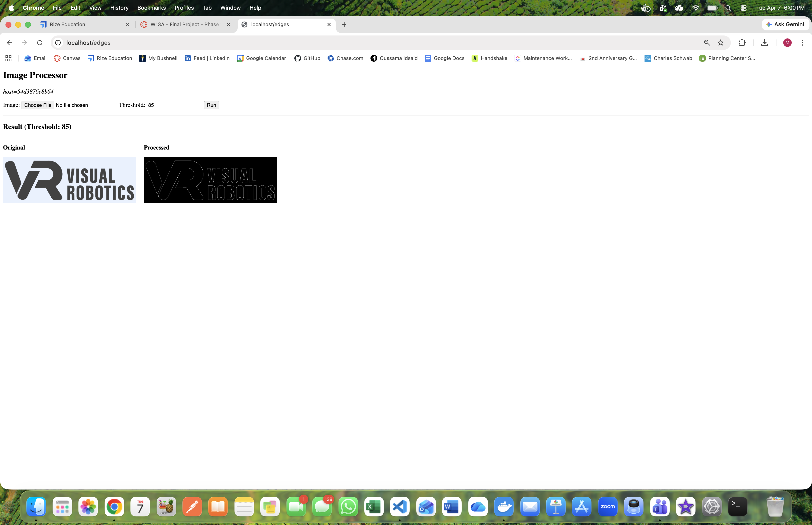

# Final Project

## Description

The project I want to do builds off of yours, but will add in making a panorama. I want people to be able to upload a series of overlapping photos, that will be stiched together into a single panoramic image using OpenCV. Then, after the images are made into a panoramic image I want to perform edge processing on in. I will display all of the steps side by side, so on the left it will have all of the original overlapping images you sibmitted, then it will have the panorama in the middle, and on the right it will display the edge detected panorama. 

## Design

First I will need to make it so that the Flask web interface can accept multiple files instead of just one. Ill do this by using `request.files.getlist()` instead of `request.files.get()`. Then I am planning on using open CVs panorama stitching functionality,Stitcher_PANORAMA, to do the panorama portion of this project. In my previous project, I used Stitcher_SCANS, but I have learned that Stitcher_PANORAMA is better when using pictures that are not perfectly level/straight because tey were taken by a person. After the panorama is made, I will just pass it through the same `detect_edges()` function that already exists in the template you gave us. The Flask web interface will  to accept multiple file uploads, display each original photo, the stitched panorama, and the final edge-detected output side by side. 
 
I am using Claude to help me with the assignment. I told it my idea in the beginning to make sure that it was all possible and I asked it today about how to make the web gui accept multiple photos instead of 1. It also helped me understand the difference between Stitcher_SCANS and Stitcher_PANORAMA, which helped me realize what I did wrong in my original panorama project. 

### Phase 1 Screenshot of running Dockerfile
-  (there was no way to submit screenshot inthe assignment on canvas)

